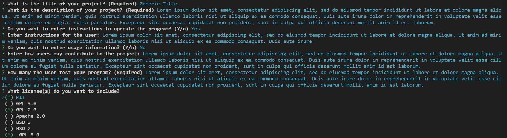
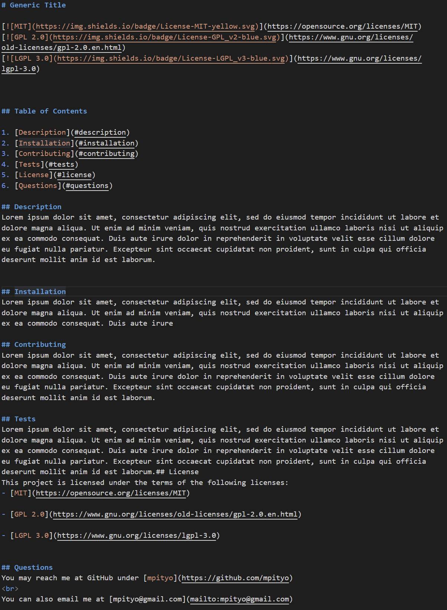
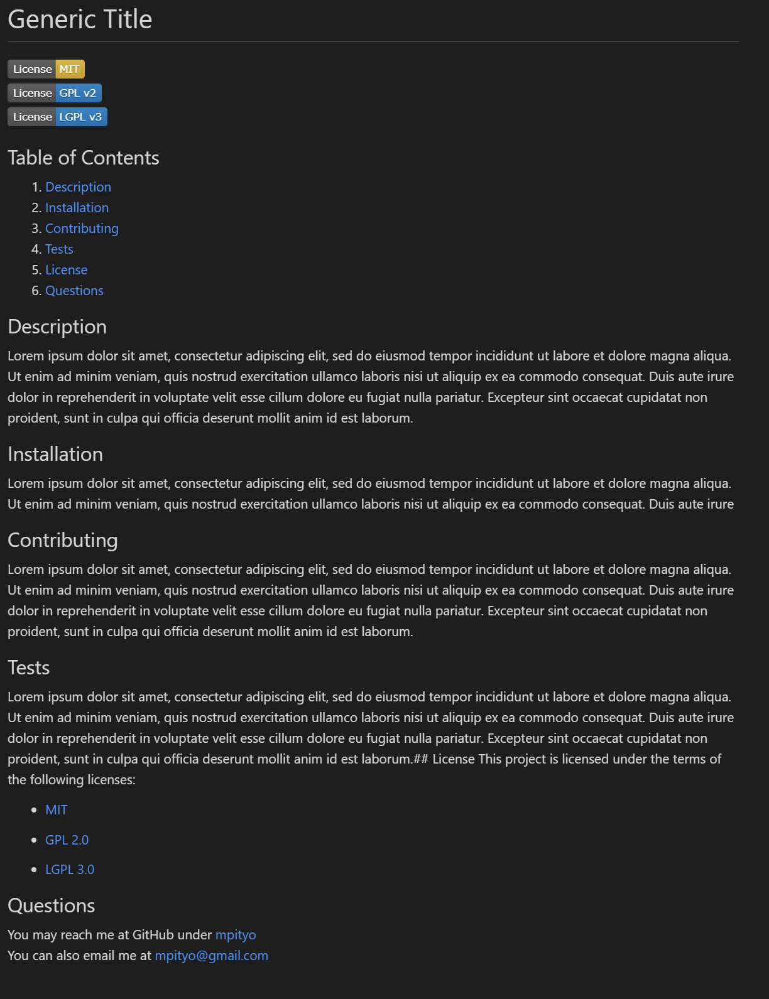

# ReadMe Generator

Create a professional README file through the command line. Input information about your project and have a quality README file ready in seconds to use.
<br>

## 🚚 Getting it up and running
1. Clone the codebase from the [repo](https://github.com/mpityo/readme-generator).
2. Query to the root file directory in any command prompt
3. Run the following command to install required packages:
```
npm install
```
4. Run app through node and fill out required sections:
```
node index.js
```
README will be created in the <heavy>./dist/</heavy> directory
<br>
See [this](https://drive.google.com/file/d/1vCSKaRb2LrJblu-u1ehnl5Y6oLJOVhUT/view?usp=sharing) link for a walkthrough, if needed.

## :memo: Features
 - Lightweight and responsive
 - Able to run on any command prompt and any system
 - Minimalistic, which means your information is front and center
 - Correct raw formatting, which means adding more to it at a later date is easy
 
## :trophy: Credit
Full Javascript/Node by @UCFBootCamp
<br>
Put together and published by yours truly, @mpityo
<br>
<br>
Project is fully open source: explore the code and upgrade away!
<br>
<br>

## :movie_camera: Screenshots


________________________________________________________


________________________________________________________


